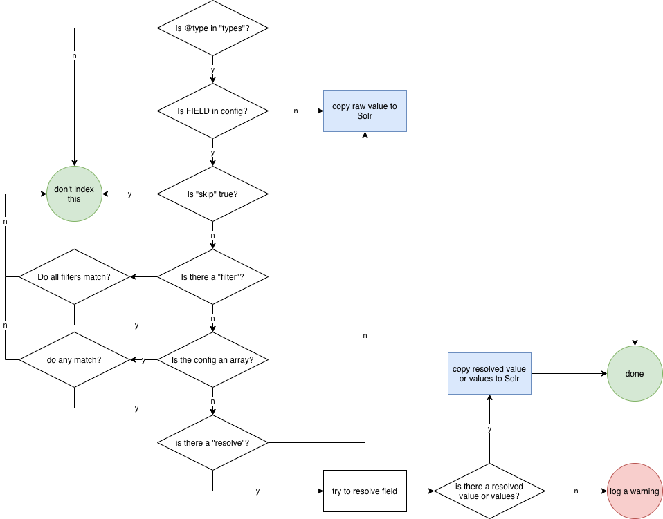

# Solr Config

The indexer config is a json file. This document describes the contents of the "fields"
block, which tells the indexer how to transform RO-Crate items into Solr index documents.

* RO-crate JSON-LD
  - item Dataset -> solr document for Dataset
  - item Person  -> solr document for Person

For the rest of the indexer config, see indexer_config.md (link coming soon)

Terminology for this document:

* graph - the JSON-LD graph in the RO-crate
* item - the graph is a list of items
* id - the id of an item in the graph
* field - keys of an item
* value - values of an item
* facet - a solr document can have one or more facets, which group it in aggregated searches
* filter - criteria by which items are included in the solr document
* solr field - field in the resulting solr index

## Sample config

This is an example of the "fields" block from an indexer config file, which shows the usual top-level config, and a very basic mapping for Dataset items.

    "fields": {
        "main_search": [ "name", "description", "id" ],
        "map_all": {
            "@id": [ "id", "id_orig" ],
            "@type": [ "record_type_s", "type_label" ]
        },
    
        "licenses": {
            "__default__": "public"
        },
    
        "types": {
    
            "Dataset": {
                "@reverse": { "skip": true },
                "hasPart": { "skip": true },
                "hasFile": { "skip": true }    
            }
        }
    }

## Top-level config

### licenses

Configures a default licence for any items which don't have an explicit licence. (Note: it's the US spelling 'license' because we decided it was better to be consistent with the schema.org spelling.)

### main_search

Configures which fields will be searched by the main search on the front page of the portal. A list of fields which will be copied from every indexed item (of every type) into the main_search field in the solr documents.

    "main_search": [ "name", "description", "author", "id" ]

### map_all

Fields which are copied for all items being indexed: allows for a case when different fields in different items may need to be folded together in the index. Each key is a field in the item and each value is a list of fields in the solr document. The default values should be left as they are.

    "map_all": {
    	"@id": [ "id", "id_orig" ],
    	"@type": [ "record_type_s", "type_label" ]
    }

## Item config

Rules for indexing items by @type. Each @type is configured by an object whose keys are fields, ie:

    "types": {
        "Dataset": {
    	   "creator":   { ... config for field 'creator' ... },
    	   "publisher": { ... config for field 'publisher' ... },
    	   "hasPart":   { ... config for field 'hasPart' }
        },
        "Person": {
            ... fields for a Person ...
        }
    }

If a @type is included in the "types" block, then each item of that type will be examined by the indexer and possibly indexed. Here is how the decision whether to index is made:

* is there a config block for this field? - if N, copy the raw value
* is **skip** true? - if Y, then skip this field
* if there is a **filter**, do any of the filters fail? - if Y, skip this entire item
* is the config block an array? - if Y, and any of the **match** conditions match, use that config block for the remaining steps
* is there a **resolve** item? - if Y, try to resolve the value, log an error if it fails
* copy the value or resolved values to Solr

The following section describes all of the key values which a config block can have.

### facet

Create a facet in the Solr index based on the value or values in this field. Facets are presented in the search interface and can be used to narrow down a search or "drill down" by category.

Facets can have a single or multiple values for a given item. For example, a facet on "year of publication" would be single, whereas a facet on "authors" would need to be multiple. To facet on multiple values, the **multi** flag needs to be set.

The value or values used for a facet can be its raw value in the item, its resolved value (found by traversing the graph), a specified field from the item, or a tokenised value.

The value of **facet** can just be **true** (note that it's a logical **true**, not the string "true"). In this case, the field will be faceted singly on its raw value.

    "name": { "facet":  true }

If the value of **facet** is an object with a value for **tokenize**, the raw value will be split on a delimiter to make a multiple facet (if **multi** is set)

An example of facetting on multiple values:

    "keywords": {
        "multi": true,
        "facet": {
            "tokenize": { "delim": "," }
        }
    }

"delim" can be a regular expression.

if the value of **facet** is an object with a value for **field**, that field will be used as the facet. (FIXME: I'm not sure how this interacts with the new resolve stuff and it may be redundant.)

Note that the **facet** config is used both at initialisation, where it turns on facetting in the Solr schema, and when indexing.

### index_as

Changes the field name which this field's value is given in the Solr index. For example,

    "author": {
        "index_as": "lead"
    }

will copy the value from the "author" field in the item to "lead" in the Solr document.

### multi

If this is set to **true**, the field will be treated as an array of values whereever this is relevant (in resolving ids and making facets).

    "authors": {
        "facet": true,
        "multi": true,
        "resolve": true
    }

### skip

If **skip** is present and true, this field will not be copied to the Solr document.

    "hasPart": { "skip": true }

### filter

Test values of this field with a filter, and exclude the entire item from the index if the filter fails. The value of filter can be a string, for exact matches, or a regular expression.

If a filter exists on multiple fields for an item, it has to pass them all to be indexed.

    "path": { "filter":  "./" }                     # only index if path is "./""
    
    "path": { "filter": { "re": "^\\./|data/$" } }  # only index if path is "./" or "data/"

### resolve

The **resolve** option is used to convert values which are links to other graph items, by following the links and returning some value from the resolved album to use in the Solr index. Here's a common example:

    {
        "@id": "./",
        "@type": "Dataset",
        "author": {
            "@id": "https://orcid.org/XXXXXXXX"
        }
        "datePublished": "2010-11-12",
        "name": "Sample dataset",
        "description": "A dataset of some kind\n",
        "id": "0f7efe84-6995-4959-9bc3-4e6d3f3d14f8",
        "keywords": [],
        "license": {
            "@id": "https://creativecommons.org/licenses/by-nc-sa/3.0/au/"
        }
    },
    {
        "@id": "https://orcid.org/XXXXXXXXX",
        "@type": "Person",
        "email": "A.Researcher@uts.edu.au"
        "familyName": "Researcher",
        "givenName": "A",
        "name": "Ms A Researcher",
    }

To have the author as a useful field in the index for Dataset, the indexer needs to follow the @id "https://orcid.org/XXXXXXXX" and then know what fields to display to the user and to use as a search key in the index.

The following config will tell the indexer to resolve author ids, display the name to the user, and use "@id" as the search key:

    {
        "types": {
            "Dataset": {
                "author": {
                    "multi": true,
                    "resolve": {
                        "display": "name",
                        "search": "@id"
                    }
                }
            }
        }
    }

If the "multi" flag is set, the results of resolution will be serialised separately and stored and facetted as an array, otherwise the values are serialised together.

**Note**: the following section describes the **via** option, which is experimental and only available on the feature-subgraph.

**resolve** can traverse more than one relation in the graph using the **via** option. The following example is three items from the @graph of an RO-Crate which models historical criminal convictions. A Person is linked to one or more Sentences, and each Sentence has a location, which is a Place (the court at which they were convicted).

    {
      "@id": "#person_VICFP_18551934_11_197",
      "@type": "Person",
      "name": "ADAMS, AMELIA",
      "conviction": [
        {
          "@id": "#conviction_2"
        }
      ]
    },
    {
      "@id": "#conviction_2",
      "@type": "Sentence",
      "object": {
        "@id": "#person_VICFP_18551934_11_197"
      },
      "name": "01-AUG-1892 ADAMS, AMELIA: 12 MONTHS BIGAMY MELBOURNE SUPREME COURT",
      "sentence": "12 MONTHS",
      "offence": {
        "@id": "#offence_BIGAMY"
      },
      "startTime": "01-AUG-1892",
      "location": {
        "@id": "#place_MELBOURNE SUPREME COURT"
      }
    },
    {
      "@id": "#place_MELBOURNE SUPREME COURT",
      "@type": "Place",
      "name": "Melbourne Supreme Court",
      "geo": {
        "@id": "#-37.808598,144.966347"
      },
      "startDate": 1852,
      "endDate": 1883,
    }

To index the name of the courts at which a person was convicted, we need to tell the indexer to resolve any @ids found in "conviction" to get to a Sentence, and then follow the "location" property on the Sentence to get to the Place:

    "conviction": {
        "resolve": {
            "via": [ { "property": "location" } ],
            "search": "@id",
            "display": "name"
        },
    }

Note that we don't have to tell the indexer the @type of the items it's following.

Also, note that because the resolver will follow every @id as it works its way down the **via** array, the number of resolved items can get large fairly quickly.

**resolve** can have the following options:

- **search** - which property of resolved items to use as a search index
- **display** - which property of resolved items to display to the user
- **via** - a list of objects which specify how to resolve across multiple item links
- **store_subgraph** - keep all of the items passed through when using **via**

**store_subgraph** is an experimental feature for indexing collections which are a single large RO-Crate. For an individual item, the subgraph is defined as everything in the collection which is related to the item along a path through the graph described in the **via** array. This allows the frontend to show an item and its "context" with a single Solr lookup, rather than having to traverse the graph at search time.

The **via** item can have the following options:

**includes** - filter resolved links to those having a certain property. For example.

    "resolve": {
        "via": [
            {
                "property": "link",
                "includes": { "@type": "Person" }
            }
        ]
    }

will only follow items on "link" if the items have "@type" equal to "Person".

### match

For situations where we need to map values from one type/field combination in an ro-crate to multiple fields in the Solr index. For example, FOR and SEO codes are both captured in the 'about' field of a Dataset:

    "about": [
        {
            "@id": "http://purl.org/au-research/vocabulary/anzsrc-for/2008/080503"
        },
        {
            "@id": "http://purl.org/au-research/vocabulary/anzsrc-for/2008/080302"
        },
        {
            "@id": "http://purl.org/au-research/vocabulary/anzsrc-for/2008/090609"
        },
        {
            "@id": "http://purl.org/au-research/vocabulary/anzsrc-seo/2008/890102"
        },
        {
            "@id": "http://purl.org/au-research/vocabulary/anzsrc-seo/2008/890202"
        }
    ],

but we may want to only index FOR codes, or index SEO and FOR codes into two different destination fields.

In this situation, we can configure multiple config items against a single type/field, and give each config item a 'match' value which is tested against the item, for example:

    "about": [
        {
            "match": { "@id": { "re": "anzsrc-for" } },
            "index_as": "FOR",
            "multi": true,
            "resolve": "multi",
            "facet": true
        },
        {
            "match": { "@id": { "re": "anzsrc-seo" } },
            "index_as": "FOR",
            "multi": true,
            "resolve": "multi",
            "facet": true
        },
     ],

The 'match' field uses the same filter spec as type filtering: in the above example, each 'about' value's '@id' field is matched against the regexp `/anzsrc-for/` for FOR codes and `/anzsrc-seo/` for SEO codes.

If a value matches more than one clause in this type of configuration, it will be indexed into Solr for every clause that it matches.

A match field can also match against plaintext values:

      "about": [
        {
            "match": { "@id": { "re": "anzsrc-for" } },
            "index_as": "FOR",
            "multi": true,
            "resolve": "multi",
            "facet": true
        },
        {
            "match": { "re": ".*" },
            "index_as": "Affiliation",
            "facet": true
        }
      ],

In the example, every 'about' item which is just a string (rather than an object) will be compared against the regexp `/.*/` - in other words, every string will be indexed as "Affiliation".

Note that at present, there would be an issue if you wanted to match against an item field called "re", as the config parser will treat "re" as a regular expression.

